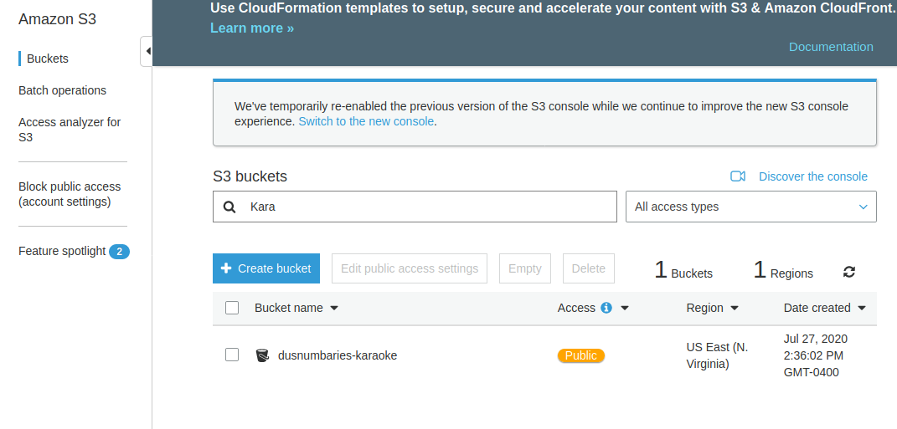
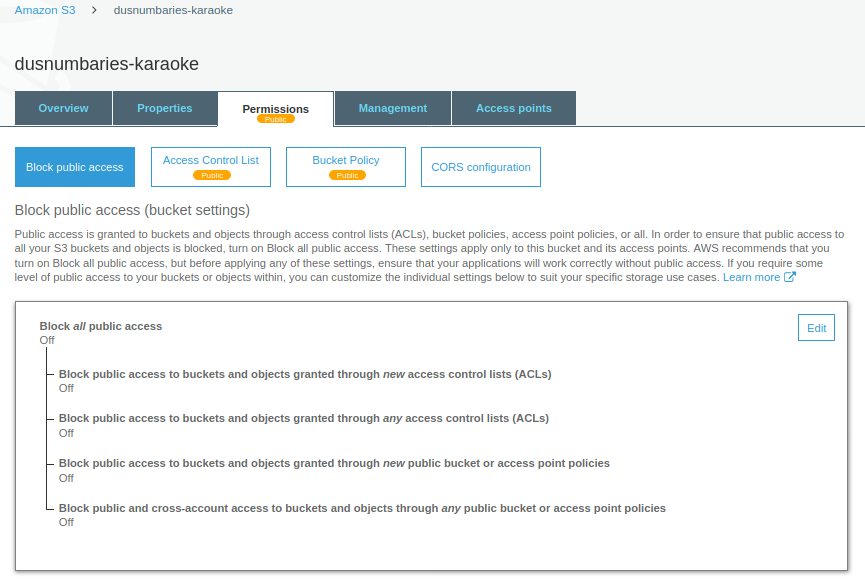
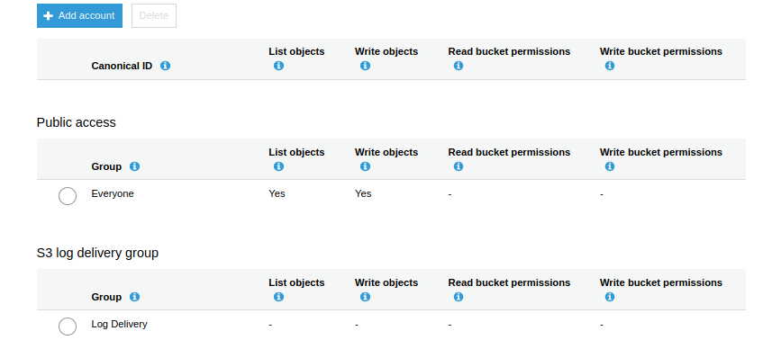
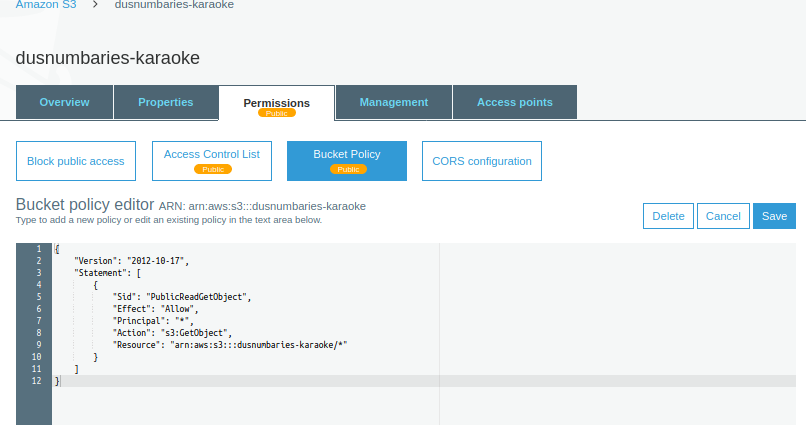
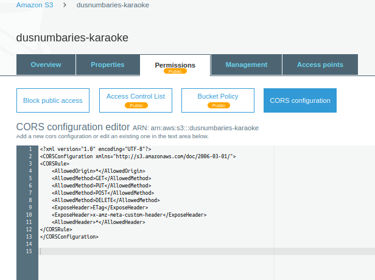

# Using S3 to store media
If you intend to use S3 to store your media, you need to configure S3 as follows. You also need to update the .env file in root (create one if not there ) and add `REACT_APP_MODEL = 'S3'` in it.

## Create bucket

Please create a bucket. Follow intructions from AWS (keeps changing, so I don't go into details here). The bucket needs to have Public access.

Pay special attention to CORS configuration, Bucket Policy and ACL. If you miss one thing, it likely won't work.

My bucket looks like this:

